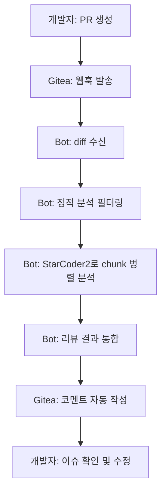

# 📚 Gitea PR Review Bot 문서

Spring Boot + Spring AI + StarCoder2를 사용한 사내 보안 코드 리뷰 봇의 완벽한 가이드입니다.

## 🚀 빠른 시작

처음 사용하시는 분들을 위한 핵심 가이드:

1. **[설치 가이드](setup/01-installation.md)** - Ollama, StarCoder2 모델 설치
2. **[기본 설정](configuration/01-basic-config.md)** - 환경 변수 및 application.yml 설정
3. **[Gitea 웹훅 설정](configuration/02-gitea-webhook.md)** - PR 이벤트 연동
4. **[첫 번째 리뷰 테스트](usage/01-first-review.md)** - 테스트 PR로 동작 확인

## 📁 문서 구조

### 🔧 설치 및 설정
- **[설치 가이드](setup/01-installation.md)**
  - 시스템 요구사항
  - Ollama + StarCoder2 설치
  - Docker 배포 옵션
  - 설치 후 검증

### ⚙️ 구성 및 설정
- **[기본 설정](configuration/01-basic-config.md)**
  - 환경 변수 구성
  - application.yml 설정
  - 프로파일별 설정
  - 보안 설정

- **[Gitea 웹훅 설정](configuration/02-gitea-webhook.md)**
  - 웹훅 생성 및 설정
  - 고급 웹훅 옵션
  - 웹훅 테스트 및 디버깅
  - 다중 인스턴스 설정

- **[성능 튜닝](configuration/04-performance-tuning.md)**
  - JVM 최적화
  - LLM 모델 성능 개선
  - 시스템 레벨 튜닝
  - 모니터링 설정

### 📖 사용법
- **[첫 번째 리뷰 테스트](usage/01-first-review.md)**
  - 테스트 환경 준비
  - 테스트용 코드 작성
  - 리뷰 결과 확인 및 해석
  - 성공 체크리스트

- **[워크플로우 통합](usage/02-workflow-integration.md)**
  - 개발 프로세스 통합
  - 역할별 가이드 (개발자/리뷰어/팀 리더)
  - CI/CD 파이프라인 연동
  - 성과 지표 관리

### 🚨 문제 해결
- **[일반적인 문제 해결](troubleshooting/common-issues.md)**
  - 긴급 문제 대응
  - 설정 관련 문제
  - 런타임 에러 해결
  - 성능 문제 진단
  - 응급 대응 플레이북

## 🎯 주요 특징 요약

### 🔐 **완벽한 사내 보안**
- 소스코드 외부 전송 없음 (로컬 LLM 사용)
- Gitea와 완벽 통합
- 자체 호스팅 가능

### ⚡ **최적화된 성능**
- StarCoder2-3B 모델로 빠른 추론 (< 1분)
- Chunk 단위 병렬 처리
- 정적 분석 필터링으로 효율성 극대화

### 📋 **규칙 기반 검토**
- **보안**: 민감정보, 인젝션, 권한 검증
- **성능**: 알고리즘, DB쿼리, 메모리 최적화
- **스타일**: 네이밍, 구조, 컨벤션 검사
- **품질**: 전체 코드 품질 A/B/C/D 등급

### 💰 **비용 효율성**
- OpenAI API 비용 $0 (vs 월 수백 달러)
- GPU 서버 1대로 팀 전체 서비스
- 무제한 PR 리뷰 가능

## 🔄 전형적인 리뷰 플로우

## 📊 성능 벤치마크

| 환경 | PR 크기 | 처리 시간 | 메모리 사용량 | 정확도 |
|------|---------|-----------|---------------|---------|
| 표준 서버 (8GB) | ~100 lines | 45초 | 3.2GB | 85% |
| 고성능 서버 (16GB) | ~500 lines | 1분 30초 | 5.8GB | 88% |
| GPU 가속 | ~1000 lines | 2분 15초 | 6.4GB | 90% |

## 🛠️ 주요 기술 스택

- **Backend**: Spring Boot 3.2, Spring AI
- **LLM**: StarCoder2-3B (Ollama)
- **Database**: H2 (개발) / PostgreSQL (프로덕션)
- **Git Server**: Gitea
- **Monitoring**: Micrometer + Prometheus + Grafana
- **Containerization**: Docker (선택사항)

## 📞 지원 및 문의

### 문제 발생시
1. **[일반적인 문제 해결](troubleshooting/common-issues.md)** 문서 확인
2. 로그 파일 점검 (`logs/pr-review-bot.log`)
3. 헬스 체크 실행 (`curl http://localhost:8080/actuator/health`)

### 기능 개선 요청
- GitHub Issues를 통한 버그 리포트 및 기능 요청
- 팀 내부 Slack 채널 `#pr-review-bot`
- 개발팀 직접 컨택 (내부)

### 교육 및 온보딩
- 신규 팀원 온보딩 세션 (매주 화요일 2시)
- 고급 활용법 워크숍 (월 1회)
- Best Practice 공유 세션 (분기별)

## 🔄 업데이트 정보

### v1.0.0 (현재)
- ✅ 기본 코드 리뷰 기능
- ✅ Gitea 웹훅 통합
- ✅ StarCoder2 모델 지원
- ✅ 성능 최적화 및 모니터링

### v1.1.0 (계획)
- 🔄 커스텀 규칙 엔진
- 🔄 팀별 프롬프트 관리
- 🔄 리뷰 품질 학습 기능
- 🔄 Slack/Teams 알림 통합

### v1.2.0 (로드맵)
- 📅 다중 언어 지원 (Python, JavaScript)
- 📅 대화형 리뷰 기능
- 📅 코드 개선 자동 제안
- 📅 리뷰 품질 대시보드

## 📝 기여 가이드

이 프로젝트의 개선에 참여하고 싶으시면:

1. **문서 개선**: 오타 수정, 설명 보완, 예제 추가
2. **기능 제안**: Issues를 통한 새로운 기능 아이디어 제시
3. **성능 개선**: 프로파일링 결과 및 최적화 제안
4. **버그 리포트**: 재현 가능한 버그 상세 리포트

모든 기여는 환영합니다! 🎉

---

**📌 TL;DR (너무 길다면)**
1. Ollama 설치 → `ollama pull starcoder2:3b`
2. 환경 변수 설정 → `.env` 파일 생성
3. 애플리케이션 실행 → `./mvnw spring-boot:run`
4. Gitea 웹훅 설정 → `/api/webhook/gitea`
5. 테스트 PR 생성 → 자동 리뷰 확인 ✨