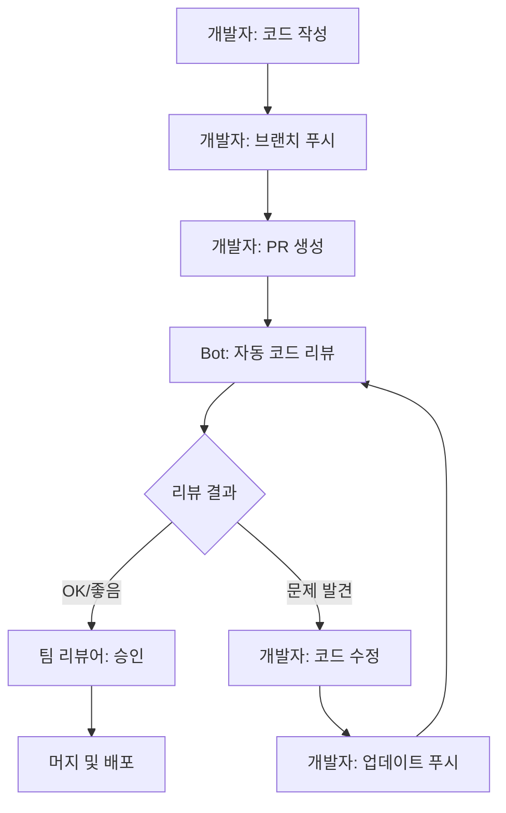

# 개발 워크플로우 통합 가이드

PR Review Bot을 팀의 일상적인 개발 워크플로우에 통합하는 방법을 설명합니다.

## 🔄 표준 워크플로우

### 기본 개발 프로세스



### 워크플로우 단계별 설명

1. **개발자 작업**
   - 피처 브랜치에서 코드 작성
   - 로컬 테스트 및 자체 검토
   - 브랜치 푸시

2. **PR 생성**
   - Gitea에서 Pull Request 생성
   - PR 템플릿 작성 (목적, 변경사항, 테스트 방법)

3. **자동 리뷰**
   - Bot이 웹훅으로 PR 이벤트 수신
   - 코드 자동 분석 및 리뷰 코멘트 작성

4. **개발자 대응**
   - Bot 리뷰 결과 확인
   - 지적된 이슈 수정
   - 필요시 추가 커밋 푸시

5. **팀 리뷰**
   - 인간 리뷰어가 비즈니스 로직 검토
   - Bot이 놓친 부분 추가 리뷰

6. **머지 및 배포**
   - 모든 검토 완료 후 머지
   - CI/CD 파이프라인 실행

## 🎯 역할별 가이드

### 👨‍💻 개발자 가이드

#### PR 생성 전 체크리스트
- [ ] 로컬에서 컴파일 및 테스트 통과
- [ ] 커밋 메시지가 명확하고 의미있음
- [ ] 변경 사항이 한 가지 목적에 집중됨
- [ ] 불필요한 파일 변경 제거 (formatting만 변경된 파일 등)

#### Bot 리뷰 결과 해석

**HIGH 우선순위 이슈 (필수 수정)**
```
[HIGH] UserService.java:23 - 보안: 하드코딩된 API 키 발견
→ 즉시 수정 필요, 환경변수나 설정 파일 사용
```

**MEDIUM 우선순위 이슈 (권장 수정)**
```
[MED] OrderService.java:45 - 성능: N+1 쿼리 가능성
→ 시간 여유시 개선, 성능에 영향 가능
```

**LOW 우선순위 이슈 (선택적 수정)**
```
[LOW] ProductDto.java:12 - 스타일: 변수명 개선 권장
→ 팀 컨벤션 준수 차원에서 수정 고려
```

#### 효과적인 수정 방법

1. **보안 이슈 수정**
```java
// AS-IS (문제)
private static final String API_KEY = "sk-1234567890";

// TO-BE (수정)
@Value("${api.key}")
private String apiKey;
```

2. **성능 이슈 수정**
```java
// AS-IS (N+1 쿼리)
users.forEach(user -> {
    List<Order> orders = orderRepository.findByUserId(user.getId());
    // ...
});

// TO-BE (배치 로딩)
Map<Long, List<Order>> orderMap = orderRepository
    .findByUserIdIn(userIds)
    .stream()
    .collect(groupingBy(Order::getUserId));
```

### 👨‍💼 팀 리더 가이드

#### Bot 리뷰 품질 모니터링

```bash
# 일일 리뷰 통계 확인
curl http://localhost:8080/actuator/metrics/review.daily

# 이슈 카테고리별 분포
curl http://localhost:8080/actuator/metrics/issues.by.category

# 개발자별 이슈 트렌드
curl http://localhost:8080/api/admin/stats/developer-trends
```

#### 팀 코딩 품질 트래킹

월간 보고서 생성:
```bash
# 스크립트: generate-monthly-report.sh
#!/bin/bash
MONTH=$(date +"%Y-%m")
curl http://localhost:8080/api/admin/reports/monthly/$MONTH > reports/review-$MONTH.json
```

### 🔍 리뷰어 가이드

#### Bot vs 인간 리뷰 영역 분담

**Bot이 잘하는 것:**
- 보안 취약점 검출
- 성능 안티패턴 발견
- 코딩 컨벤션 체크
- 코드 중복 감지

**인간이 집중해야 할 것:**
- 비즈니스 로직 정확성
- 아키텍처 설계 적절성
- 요구사항 충족 여부
- 사용자 경험 관점

#### Bot 리뷰 결과 활용

1. **Bot 리뷰를 기준점으로 활용**
```
✅ Bot이 이미 확인한 항목:
- 보안 이슈 없음
- 성능 문제 없음
- 스타일 가이드 준수

🔍 인간 리뷰어가 집중할 항목:
- 비즈니스 로직 검증
- 엣지 케이스 처리
- 테스트 커버리지
```

2. **Bot 리뷰를 보완하는 관점**
- Bot이 놓칠 수 있는 맥락적 문제
- 도메인 특화적인 규칙
- 팀의 암묵적 약속사항

## 📋 PR 템플릿 최적화

### Bot 친화적 PR 템플릿

Gitea PR 템플릿 (`.gitea/pull_request_template.md`):

```markdown
## 📝 변경 사항 요약
<!-- Bot이 이해할 수 있도록 명확하게 작성 -->

### 🎯 목적
- [ ] 새 기능 추가
- [ ] 버그 수정
- [ ] 리팩토링
- [ ] 성능 개선
- [ ] 보안 강화

### 📋 주요 변경 내용
<!-- 파일별로 주요 변경사항 요약 -->
- `UserService.java`: 사용자 조회 로직 개선
- `UserController.java`: 새로운 API 엔드포인트 추가
- `user.sql`: 인덱스 추가로 조회 성능 향상

### 🔍 Bot 리뷰 가이드
<!-- Bot에게 특별히 확인받고 싶은 부분 -->
- [ ] 보안: 새로운 API 엔드포인트 권한 검사
- [ ] 성능: 대용량 데이터 처리 최적화
- [ ] 스타일: 새로운 유틸리티 클래스 네이밍

### 🧪 테스트
- [ ] 단위 테스트 추가/수정
- [ ] 통합 테스트 확인
- [ ] 수동 테스트 완료

### 📚 관련 이슈
Closes #123
Related to #456
```

## ⚡ 성능 최적화된 워크플로우

### 대용량 PR 처리 전략

```yaml
# 대용량 PR 처리 설정
bot:
  review:
    # PR 크기별 처리 방식
    size-based-strategy:
      small:          # < 100 lines
        chunk-size: 50
        full-analysis: true
      medium:         # 100-500 lines
        chunk-size: 100
        full-analysis: true
      large:          # 500-1000 lines
        chunk-size: 200
        focus-on-critical: true
      extra-large:    # > 1000 lines
        summary-only: true
        critical-issues-only: true
```

### 브랜치별 리뷰 전략

```yaml
bot:
  review:
    branch-strategies:
      main:
        strict-mode: true
        all-categories: true
        require-approval: true
      develop:
        balanced-mode: true
        skip-style-minor: true
      feature/*:
        fast-mode: true
        security-and-performance-only: true
      hotfix/*:
        emergency-mode: true
        critical-issues-only: true
```

## 🔄 CI/CD 파이프라인 통합

### GitHub Actions 통합 예시

```yaml
# .github/workflows/pr-review.yml
name: Enhanced PR Review

on:
  pull_request:
    types: [opened, synchronize, ready_for_review]

jobs:
  static-analysis:
    runs-on: ubuntu-latest
    steps:
      - uses: actions/checkout@v3
      - name: Run Static Analysis
        run: |
          # SonarQube, SpotBugs 등 실행
          ./gradlew sonarqube

  ai-review:
    runs-on: ubuntu-latest
    needs: static-analysis
    steps:
      - name: Trigger Bot Review
        run: |
          curl -X POST ${{ secrets.BOT_WEBHOOK_URL }} \
            -H "Content-Type: application/json" \
            -d '{
              "repository": "${{ github.repository }}",
              "pr_number": ${{ github.event.number }},
              "static_analysis_results": "${{ needs.static-analysis.outputs.results }}"
            }'

  merge-gate:
    runs-on: ubuntu-latest
    needs: [static-analysis, ai-review]
    if: github.event.action == 'ready_for_review'
    steps:
      - name: Check Review Status
        run: |
          # Bot 리뷰 완료 및 승인 확인
          # 모든 HIGH 이슈 해결 확인
```

### 머지 조건 설정

```yaml
# 머지 전 필수 조건
merge-requirements:
  - static-analysis-pass: true
  - bot-review-complete: true
  - no-high-severity-issues: true
  - human-approval-required: true
  - ci-tests-pass: true
```

## 📊 워크플로우 메트릭

### KPI 모니터링

```bash
# 일일 대시보드 생성
./scripts/daily-dashboard.sh

# 주요 메트릭:
# - PR 처리 시간 평균
# - Bot 리뷰 정확도
# - 개발자별 코드 품질 트렌드
# - 리뷰 후 수정률
```

### 팀 성과 지표

| 지표 | 목표 | 현재 | 트렌드 |
|------|------|------|--------|
| 평균 PR 리뷰 시간 | < 2분 | 1.3분 | ⬇️ 개선 |
| HIGH 이슈 검출률 | > 95% | 97% | ⬆️ 양호 |
| 개발자 만족도 | > 4.0/5 | 4.2/5 | ➡️ 안정 |
| False Positive 율 | < 10% | 8% | ⬇️ 개선 |

## 🚨 예외 상황 대응

### Bot 서비스 장애시 대응

```yaml
# Fallback 프로세스
fallback-strategy:
  when-bot-unavailable:
    - manual-checklist-review: true
    - extended-human-review: true
    - post-merge-retrospective: true

  when-llm-slow:
    - timeout-after: 5min
    - fallback-to-static-analysis: true
    - queue-for-later-review: true
```

### 긴급 배포시 워크플로우

```bash
# 긴급 패치 프로세스
./scripts/emergency-deploy.sh
# 1. Bot 리뷰 우선순위 최고로 설정
# 2. 보안 이슈만 집중 검토
# 3. 배포 후 전체 리뷰 스케줄링
```

## ✅ 워크플로우 성공 체크리스트

### 개발자 관점
- [ ] PR 생성시 자동으로 리뷰 시작
- [ ] 리뷰 결과를 쉽게 이해하고 적용 가능
- [ ] 수정 후 재리뷰가 빠르게 진행됨
- [ ] 개발 속도 저하 없음

### 팀 관점
- [ ] 코드 품질 지표 개선
- [ ] 리뷰 시간 단축
- [ ] 보안 이슈 사전 차단
- [ ] 팀 코딩 컨벤션 준수율 향상

### 운영 관점
- [ ] Bot 가용성 > 99%
- [ ] 응답 시간 < 2분
- [ ] False Positive < 10%
- [ ] 개발자 만족도 > 4.0/5

## 📚 다음 단계

워크플로우 통합이 완료되면:
1. [팀 온보딩 가이드](03-team-onboarding.md)로 팀원 교육
2. [고급 사용법](04-advanced-usage.md)으로 기능 확장
3. [성능 최적화](../configuration/04-performance-tuning.md)로 시스템 개선